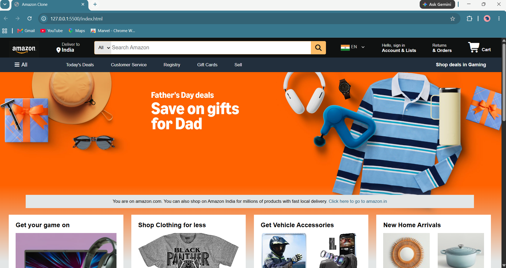
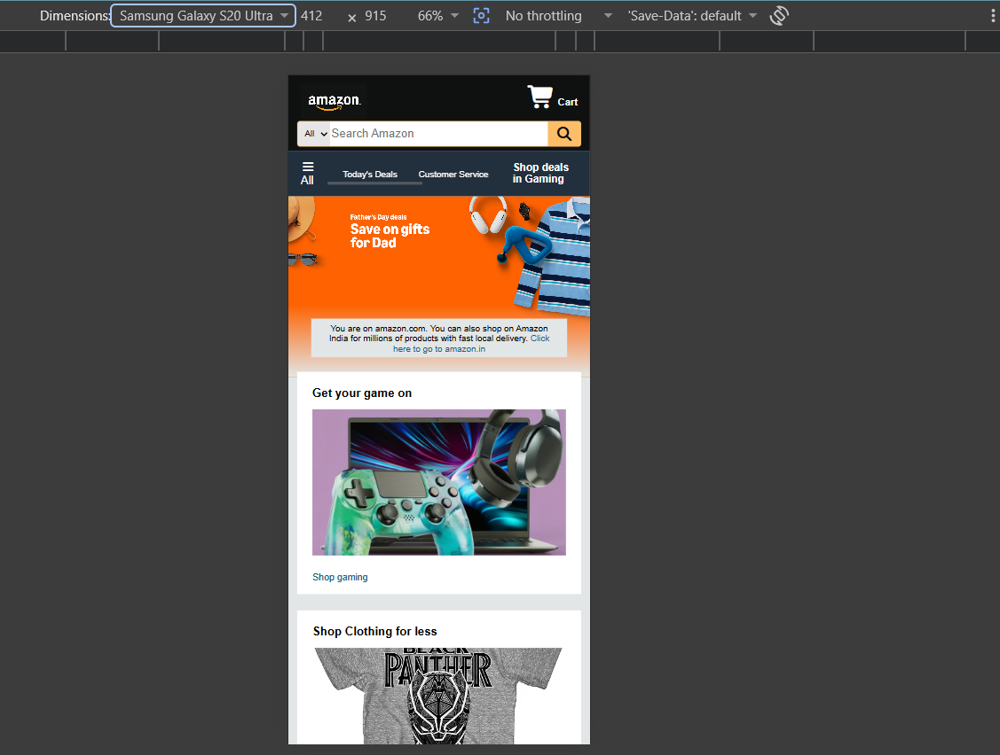
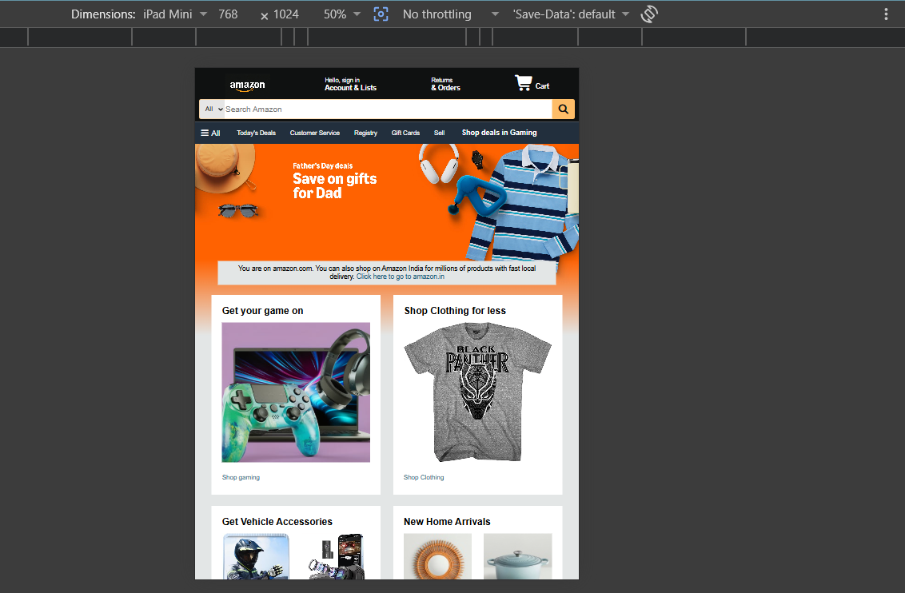

# Amazon Clone
A front-end Amazon homepage clone built with HTML and CSS.

## Live Demo
[Click here to view](https://tjshar.github.io/PROJECT-Basic_Amazon_Clone/)

## Screenshots

### Desktop

### Mobile

### Tablet

## Features
- Responsive Navbar with search bar
- Hero section with slideshow image
- Product category shop cards
- Fully responsive (Desktop, Tablet, Mobile)
- Footer with links

## Tech Stack
- HTML5
- CSS3

## What I Learned
- CSS Flexbox and Grid for layouts
- Responsive design using media queries
- Structuring a real-world webpage from scratch

## How to Run
Just open `index.html` in your browser.